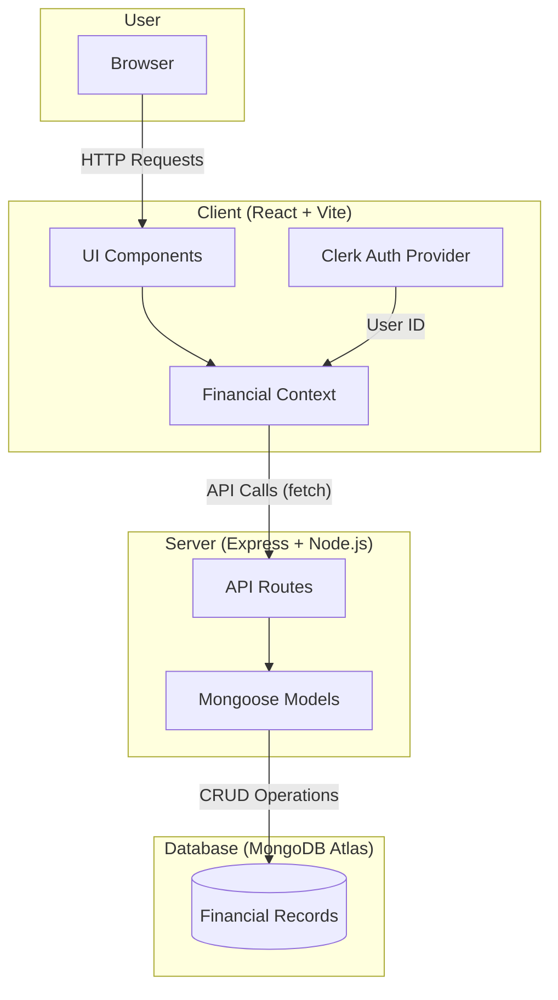

<p align="center">
  
</p>

<h1 align="center">💰 BudgetBuddy</h1>

<p align="center">
  <strong>A modern, full-stack personal finance tracker to help you manage your expenses effortlessly.</strong>
</p>

<p align="center">
  
  
  
  
  
</p>

---

## ✨ Features

| Feature | Description |
| :--- | :--- |
| 🔐 **Secure Authentication** | Powered by [Clerk](https://clerk.com) for seamless and secure user sign-up/sign-in. |
| 📊 **Expense Tracking** | Add, edit, and delete financial records with ease. |
| 🏷️ **Categorization** | Organize your transactions by custom categories. |
| 📅 **Date Tracking** | Keep a log of when each transaction was made. |
| 👤 **User-Specific Data** | Each user's financial data is private and isolated. |

---

## 🏗️ Architecture

BudgetBuddy follows a classic **MERN + TypeScript** (MERT?) stack architecture, decoupled into a **Client** (Frontend) and **Server** (Backend).



---

## 🔄 How It Works

1.  **User Authentication**: When a user opens the app, they are prompted to sign in via Clerk. This provides a unique `userId` for all subsequent operations.
2.  **Data Fetching**: On the Dashboard, the client sends a `GET` request to `/financial-records/getAllByUserID/:userId` to fetch all records for that user.
3.  **CRUD Operations**:
    *   **Create**: The user fills out a form to add a new record. A `POST` request is sent to `/financial-records/`.
    *   **Update**: The user edits a record inline in the table. A `PUT` request is sent to `/financial-records/:id`.
    *   **Delete**: The user clicks a delete button. A `DELETE` request is sent to `/financial-records/:id`.
4.  **State Management**: The `FinancialRecordsContext` manages the state on the client, ensuring the UI is always in sync with the database.

---

## 📂 Project Structure

```
financial-tracker-react/
├── client/                 # Frontend Application
│   ├── src/
│   │   ├── contexts/       # React Context for state management
│   │   ├── pages/          # Page components (Auth, Dashboard)
│   │   ├── App.tsx         # Main App component with routing
│   │   └── main.tsx        # Entry point with Clerk Provider
│   └── package.json
│
├── server/                 # Backend API
│   ├── src/
│   │   ├── routes/         # Express API routes
│   │   ├── schema/         # Mongoose schemas
│   │   └── index.ts        # Server entry point
│   └── package.json
│
└── assets/                 # Project assets (hero image)
```

---

## 🚀 Getting Started

### Prerequisites
-   **Node.js** (v18+)
-   **npm** or **yarn**
-   A **Clerk** account ([clerk.com](https://clerk.com))

### 1. Clone the Repository
```bash
git clone <your-repo-url>
cd financial-tracker-react
```

### 2. Set Up the Server
```bash
cd server
npm install
npm run dev
```
> The server will run on `http://localhost:3001`.

### 3. Set Up the Client
```bash
cd client
npm install
```
Create a `.env` file with your Clerk key:
```env
VITE_CLERK_PUBLISHABLE_KEY=pk_test_xxxxxxxxxx
```
Then start the client:
```bash
npm run dev
```
> The client will run on `http://localhost:5173`.

---

## 📜 License

This project is open-source under the MIT License.
